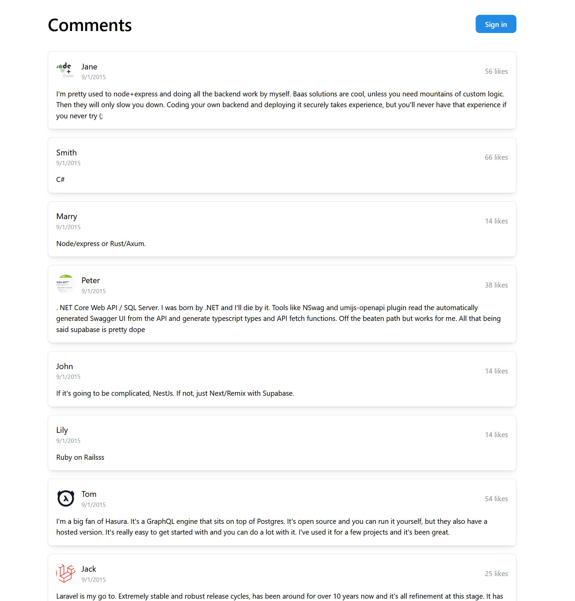
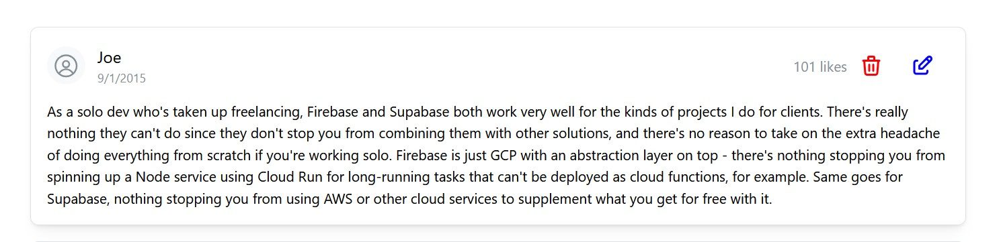
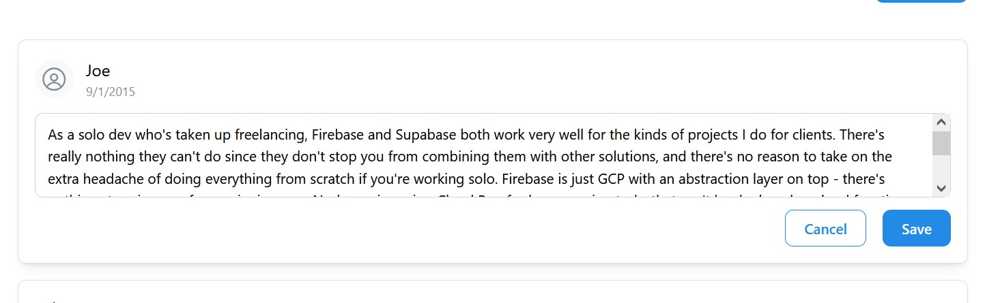

# fluffy-octo-eureka
Takehome Assessment for a company (Linking them to this so not going to share and let this be index-able because public repo)

Backend and Frontend have their own generated docs for launching. Both need to be running in order for things to load correctly

Ran out of time.
Would have added on frontend:

* Feature to handle likes -- Robust + add list of comment IDs to determine which ones were liked already
* Fixing a bug where re-renders cause signing-out -- Store userId as cookie/local storage + put a few objects in a context file.

Backend:

* Backend could be more optimized, but fast API is a good system for quick uptime
* A postgres DB -- Too heavy for current impl. SqlLite is current implementation and allows quick uptime. comments.db will be created 
* Containerized this in Docker or something similar like K8, but again no point given time constraint + debugging
* There's a weird encoding issue with special characters. They're de-coded on the frontend -- Have not tested for encoding so comments pushed with special characters will likely break something somewhere.

Overall: 

* Containerization would have been appropriate for backend and maybe frontend as well. Database is inside of backend, but if more robust database like postgresql would have been picked, it would have needed it's own container which, again, is extra overhead.
* More robust Auth would have been nice -- Right now it's literally just checking if the user ID is the same or if it's an admin ("Admin").
* Style is pretty basic -- React app was generated && GPT generated mantine comment object but this is good enough to display what we want.
* SQL Lite Database & Fast API Backend was picked out of speed requirement more than anything so more could be done here.
* Deleting should "hide" commments by setting a flag in the object then changing display in the UI. If a user's comment is deleted, that user and the Admin should see that it is deleted with the option to restore for the Admin user.

Started around 5pm on 1/4 -- ended at 6:55 on 1/4

A postman collection has been added for convenience (collection.postman_collection.json)

# Basic Launch Instructions

1. Open 2 terminals
2. Navigate 1 to /frontend and the other to /backend
3. In /frontend, run `npm i` then `npm run dev`
4. In /backend, run `pip install -r requirements.txt` then `uvicorn api:app --reload`
5. Check to ensure database has been created and refresh frontend if any errors occur. Frontend should look like this:

6. Sign in using any of your choice userId (Recommend something that's one word). A edit box should appear at the bottom:

7. When "Admin" is the logged in user or a user ID is the same as presented in a comment, a trash can (delete) and an edit Icon appear:

8. When editing, it looks like this. Click "Save" to save the comment or cancel to ignore and forfeit changes:

# Happy commenting!